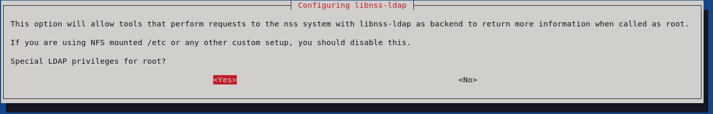

# SLAPD - Installation & configuration on Debian 11
- Server side
    - [OpenLDAP introduction](#openldap-introduction)
    - [SLAPD installation](#slapd-installation)
    - [Starting with SLAPD](#starting-with-slapd)
    - [Database software](#database-software)
    - [SLAPD configuration](#slapd-configuration)
        - [Basis](#basis)
        - [Create users and groups](#create-users-and-groups)
        - [Transport Layer Security](#transport-layer-security)
        - [Disable anonymous mode](#disable-anonymous-mode)
        - [Logs configuration](#logs-configuration)
        - [Back-up & Restore](#backuprestore)
        - [Change the rootDN password](#change-the-rootdn-password)
        - [Delete a user](#delete-a-user)
- Client side
    - [Installation](#installation)

---

# Server Side

## OpenLDAP introduction 

As an introduction, I would recommend to read [this](https://www.openldap.org/doc/admin24/intro.html)

---

## SLAPD installation

First of all, let's install SLAPD ([Standalone LDAP Daemon](https://en.wikipedia.org/wiki/Slapd))

    sudo apt update
    sudo apt upgrade
    sudo apt install slapd

It will ask for an LDAP password, <u>please choose a strong one</u>. Then it will configure some parameters by default.

To perform administrative tasks, the slapd package installs the following utilities into the */usr/sbin/* directory: 


---

## Starting with slapd

We can see the default configuration with : [slapcat](https://linux.die.net/man/8/slapcat)

    sudo slapcat

This command shows the configuration of the default **domain** database. We're going to modify/configure it [later](#slapd-configuration). But in the meantime let's go deeper :

    sudo slapcat -b cn=config

The output should be quite long. Let me explain some things here:

1) **-b** Use the specified suffix to determine which database to generate output for.

2) The slapd-config configuration tree has a very specific structure. The root of the tree is named **cn=config** and contains the **global configuration settings**. Later we will play deeper with **-b** to look for specific information in the tree, other than *cn=config* base. But to summarize : *slapcat* will show the <u>data</u> database, and *slapcat -b cn=config* will show the <u>configuration</u> database

3) The general layout of the config LDIF (meaning : our output here) is as follows:

        # global configuration settings
        dn: cn=config
        objectClass: olcGlobal
        cn: config
        <global config settings>

        # schema definitions
        dn: cn=schema,cn=config
        objectClass: olcSchemaConfig
        cn: schema
        <system schema>

        dn: cn={X}core,cn=schema,cn=config
        objectClass: olcSchemaConfig
        cn: {X}core
        <core schema>

        # additional user-specified schema
        ...

        # backend definitions
        dn: olcBackend=<typeA>,cn=config
        objectClass: olcBackendConfig
        olcBackend: <typeA>
        <backend-specific settings>

        # database definitions
        dn: olcDatabase={X}<typeA>,cn=config
        objectClass: olcDatabaseConfig
        olcDatabase: {X}<typeA>
        <database-specific settings>

        # subsequent definitions and settings
        ...


if you scroll you can see some interesting outputs :

&nbsp;&nbsp;&nbsp;&nbsp;&nbsp;&nbsp;[1) olcArgsFile: /var/run/slapd/slapd.args](#olcargsfilevarrun)  
&nbsp;&nbsp;&nbsp;&nbsp;&nbsp;&nbsp;[2) olcPidFile: /var/run/slapd/slapd.pid](#olcpidfilevarrun)  
&nbsp;&nbsp;&nbsp;&nbsp;&nbsp;&nbsp;[3) olcRootDN: cn=admin,dc=nodomain](#olcrootdnadmin)  
&nbsp;&nbsp;&nbsp;&nbsp;&nbsp;&nbsp;[4) olcRootPW:: xxxhashedxxxpassword=](#olcrootpwadmin)  

#### 1) olcArgsFile: /var/run/slapd/slapd.args <a id="olcargsfilevarrun"></a>
&nbsp;&nbsp;&nbsp;&nbsp;&nbsp;This is how the service is [launched](https://www.openldap.org/doc/admin24/runningslapd.html)


<a id="tableldapaccess"></a>&nbsp;&nbsp;&nbsp;&nbsp;&nbsp;**-h <URLs>** This option specifies alternative listener configurations. The default is ldap:/// which implies LDAP over TCP on all interfaces on the default LDAP port 389. You can specify specific host-port pairs or other protocol schemes (such as ldaps:// or ldapi://).

| URL | Protocol | Transport |
|:---:|:---:|:---:|
| **ldap:///** | LDAP | TCP port **389** |
| **ldaps:///** | LDAP over SSL | TCP port **636** |
| **ldapi:///** | LDAP | **IPC** (Unix-domain socket) | 

&nbsp;&nbsp;&nbsp;&nbsp;&nbsp;&nbsp;**-u user -g group** These options specify the user and group, respectively, to run as. user can be either a user name or uid. group can be either a group name or gid.

&nbsp;&nbsp;&nbsp;&nbsp;&nbsp;**-F <slapd-config-directory>** Specifies the slapd configuration directory. The default is */etc/ldap/slapd.d*

#### 2) olcPidFile: /var/run/slapd/slapd.pid <a id="olcpidfilevarrun"></a>

&nbsp;&nbsp;&nbsp;&nbsp;&nbsp;This is where the process ID is stored

#### 3) olcRootDN: cn=admin,dc=nodomain <a id="olcrootdnadmin"></a>

&nbsp;&nbsp;&nbsp;&nbsp;&nbsp;Here the root login is **admin** and we will use it for configuration commands

#### 4) olcRootPW <a id="olcrootpwadmin"></a>

&nbsp;&nbsp;&nbsp;&nbsp;&nbsp;&nbsp;This directive store the password for *RootDN*. So if we'd need to change the LDAP root password, we need to modify *olcRootPW*, we will see this later.

&nbsp;&nbsp;&nbsp;&nbsp;&nbsp;&nbsp;*slappasswd* may be used to generate the password hash. We will also see it later.

---

## Database software

In our previous output, from *sudo slapcat -b cn=config*, we can also see database information:

    olcDatabase: {1}mdb
    olcDbDirectory: /var/lib/ldap

[**mdb**](https://www.openldap.org/doc/admin24/backends.html#LMDB) stands for  **Memory-Mapped DB**

The mdb backend to slapd is the recommended primary backend for a normal slapd database. It uses OpenLDAP's own Lightning Memory-Mapped Database (LMDB) library to store data and is intended to replace the Berkeley DB backends.

It supports indexing like the BDB backends, but it uses no caching and requires no tuning to deliver maximum search performance. Like hdb, it is also fully hierarchical and supports subtree renames in constant time.

There is no need to download any additional software to have MDB support.

*<u>Remark</u>: on old tutorials you will see dbd, or even hdb, instead of mdb. But again: today mbd is the best choice*

---

## SLAPD configuration  

### Basis
So now that we've installed slapd and checked that the service is up & running, we are going to modify OpenLDAP Default BaseDN by:

```
sudo dpkg-reconfigure slapd
```


Now try again slapcat to check your new dc base:

    sudo slapcat

And check if you can send a request, thus accessing the database :

    ldapsearch -x -LLL -H ldapi:/// -b dc=tux,dc=lan

&nbsp;&nbsp;&nbsp;&nbsp;**-x** to bypass SASL/DIGEST-MD5 authentication

&nbsp;&nbsp;&nbsp;&nbsp;**-LLL** Clear the result : no comments, no version, only the result.  
&nbsp;&nbsp;&nbsp;&nbsp;Search results are display in LDAP Data Interchange Format detailed in ldif.  
&nbsp;&nbsp;&nbsp;&nbsp;A single -L restricts the output to LDIFv1. A second -L disables comments.  A third -L disables printing of the LDIF version.  
&nbsp;&nbsp;&nbsp;&nbsp;*Do not hesitate to try the same command without -LLL to see the difference.*  

&nbsp;&nbsp;&nbsp;&nbsp;We've already seen **-b** and **-H** before.

Check also who you are :

    ldapwhoami -H ldapi:/// -x

**anonymous** is excpected, as by default there is an anonymous access. We will disable it later.
Try also with a distinguished name (for the moment the only "user" is admin):


    ldapwhoami -H ldapi:/// -x -D "cn=admin,dc=tux,dc=lan" -W

&nbsp;&nbsp;&nbsp;&nbsp;**-D** Use the Distinguished Name binddn to bind to the LDAP directory.  
&nbsp;&nbsp;&nbsp;&nbsp;**-W** Prompt for simple authentication. Meaning it will ask the password for the -D "user"

So, at this point, if everything works, it means that the basis configuration is ok, and that we can access our database.  
Try also with *-H ldap://127.0.0.1* instead of [ldapi:///](#tableldapaccess). Or even without *-H xxx*

---

### Create Users and Groups

First, let's create the **organisation unit**s *people* and *group*, via a an ldif file (for instance : *vim ou_user_group.ldif*).
```
dn: ou=people,dc=tux,dc=lan
objectClass: organizationalUnit
ou: people

dn: ou=group,dc=tux,dc=lan
objectClass: organizationalUnit
ou: group
```
Then let's populate this data in our database, via **ldapadd** :
```
ldapadd -x -D cn=admin,dc=tux,dc=lan -W -f ou_user_group.ldif
```
**-f** for file. *Read the entry modification information from file instead of from standard input*
If everything goes well:
```
Enter LDAP Password: 
adding new entry "ou=people,dc=tux,dc=lan"

adding new entry "ou=group,dc=tux,dc=lan"
```
**Adding user account & group:**

Let's hash a new password in a new ldif file:
```
sudo slappasswd > new_user.ldif
New password: 
Re-enter new password: 
```
Now we need to use attributes in order to create new entries (in the same ldif file):
```
dn: uid=bob,ou=people,dc=tux,dc=lan
objectClass: inetOrgPerson
objectClass: posixAccount
uid: bob
cn: bob
sn: bob
userPassword: {SSHA}Anbls0D+JvqO1WAuUGT9eVfV+la5uocr
loginShell: /bin/bash
uidNumber: 10000
gidNumber: 10000
homeDirectory: /home/bob

dn: cn=bob,ou=group,dc=tux,dc=lan
objectClass: posixGroup
cn: bob
gidNumber: 10000
memberUid: bob
```
And finally, let's populate it in our db:
```
    ldapadd -x -D cn=admin,dc=tux,dc=lan -W -f new_user.ldif
```
```
    Enter LDAP Password: 
    adding new entry "uid=bob,ou=people,dc=tux,dc=lan"

    adding new entry "cn=bob,ou=group,dc=tux,dc=lan"
```
Let's see if everything is worked:
```
ldapsearch -x -b dc=tux,dc=lan
```
```
ldapsearch -x -b uid=bob,ou=people,dc=tux,dc=lan
```
Test login access, enter bob's password when prompted:

    ldapwhoami -x -D uid=bob,ou=people,dc=tux,dc=lan -W

If you want to change quickly the password of bob (you can also do that via an ldif file and **ldapmodify**):

    ldappasswd -H ldapi:/// -x -D "cn=admin,dc=tux,dc=lan" -W -S "uid=bob,ou=people,dc=tux,dc=lan"

---

### Transport Layer Security

We are going to use self signed certificates. To do so we need to create 3 certificates :
- A CA certificate
- A server certificate
- A server certificate key file

OpenSSL should be already installed with Debian, so no need to install it.
Create these new folders:

    sudo mkdir -p /etc/ssl/openldap/{private,certs,newcerts}

Then we modify */usr/lib/ssl/openssl.cnf* to aim our new folder in *[ CA_default ]* section


We need a new file for tracking purpose (OpenSSL needs it):

    echo "1001" | sudo tee /etc/ssl/openldap/serial

and

    sudo touch /etc/ssl/openldap/index.txt

Let's go! Create a **CA Key file**. And remember your secret passphrase in order to remove it.

    sudo openssl genrsa -aes256 -out /etc/ssl/openldap/private/cakey.pem 2048

Remove the passphrase:

    sudo openssl rsa -in /etc/ssl/openldap/private/cakey.pem -out /etc/ssl/openldap/private/cakey.pem

Create the **CA certificate**. Be sure to set the common name to match your own server FQDN (for me, it is : ldap.tux.lan).

    sudo openssl req -new -x509 -days 3650 -key /etc/ssl/openldap/private/cakey.pem -out /etc/ssl/openldap/certs/cacert.pem


Create LDAP **server key**:

    sudo openssl genrsa -aes256 -out /etc/ssl/openldap/private/ldapserver-key.key 2048

Remove the passphrase.

    sudo openssl rsa -in /etc/ssl/openldap/private/ldapserver-key.key -out /etc/ssl/openldap/private/ldapserver-key.key

Create the certificate signing request (**CSR**). Be sure to configure the same details as you did when generating the CA certificate file above.

    sudo openssl req -new -key /etc/ssl/openldap/private/ldapserver-key.key -out /etc/ssl/openldap/certs/ldapserver-cert.csr

Create the LDAP **server certificate** and sign it with CA key and certificate generated before.

    sudo openssl ca -keyfile /etc/ssl/openldap/private/cakey.pem -cert /etc/ssl/openldap/certs/cacert.pem -in /etc/ssl/openldap/certs/ldapserver-cert.csr -out /etc/ssl/openldap/certs/ldapserver-cert.crt

To verify the LDAP server cert against the CA cert:

    sudo openssl verify -CAfile /etc/ssl/openldap/certs/cacert.pem /etc/ssl/openldap/certs/ldapserver-cert.crt

*/etc/ssl/openldap/certs/ldapserver-cert.crt: **OK***

Now, we have the <u>CA certificate file</u>, the <u>server certificate</u> and the <u>server key file</u> under the following respective directories.

    /etc/ssl/openldap/certs/cacert.pem

    /etc/ssl/openldap/certs/ldapserver-cert.crt

    /etc/ssl/openldap/private/ldapserver-key.key

Next, set the ownership of the OpenLDAP certificates directory to openldap user.

    sudo chown -R openldap: /etc/ssl/openldap/

Now we're going to tell OpenLDAP to use our certificates :

Make a new ldif file : *vim ldap-tls.ldif*
```
dn: cn=config
changetype: modify
add: olcTLSCACertificateFile
olcTLSCACertificateFile: /etc/ssl/openldap/certs/cacert.pem
-
replace: olcTLSCertificateFile
olcTLSCertificateFile: /etc/ssl/openldap/certs/ldapserver-cert.crt
-
replace: olcTLSCertificateKeyFile
olcTLSCertificateKeyFile: /etc/ssl/openldap/private/ldapserver-key.key
```
You already know how to add it. Let's try with -Y

```
sudo ldapadd -Y EXTERNAL -H ldapi:/// -f ldap-tls.ldif
```
-Y EXTERNAL, this means that it will use the privilege of the system user that issue the command.  
And if you look in the cn=config base, you can see that the uid/gid 0 is allowed (so the root/sudo):
```
olcAccess: {0}to * by dn.exact=gidNumber=0+uidNumber=0,cn=peercred,cn=extern
```
```
SASL/EXTERNAL authentication started
SASL username: gidNumber=0+uidNumber=0,cn=peercred,cn=external,cn=auth
SASL SSF: 0
modifying entry "cn=config"
```
Check if ok :
```
sudo slapcat -b "cn=config" | grep olcTLS
```
```
olcTLSCACertificateFile: /etc/ssl/openldap/certs/cacert.pem
olcTLSCertificateFile: /etc/ssl/openldap/certs/ldapserver-cert.crt
olcTLSCertificateKeyFile: /etc/ssl/openldap/private/ldapserver-key.key
```
Check the validity of the LDAP configuration:
```
sudo slaptest -u
```
```
config file testing succeeded
```
Next, change the location of the CA certificate. Open the */etc/ldap/ldap.conf* configuration file (or create it if not present) 
```
# TLS certificates (needed for GnuTLS)
#TLS_CACERT	/etc/ssl/certs/ca-certificates.crt
TLS_CACERT	/etc/ssl/openldap/certs/cacert.pem
```
**Allowing LDAPS (LDAP over TLS):**  

Firest, check what port is opened at this the moment:
```
sudo lsof -i -P | grep slapd
```
```
slapd    4780 openldap    8u  IPv4  32449      0t0  TCP *:389 (LISTEN)
slapd    4780 openldap    9u  IPv6  32450      0t0  TCP *:389 (LISTEN)
```
**389** is the standard port for LDAP. So let's open *ldap over TLS* :  

*sudo vim /etc/default/slapd*  

And add:


Restart OpenLDAP daemon and check the status.

    sudo systemctl restart slapd

    sudo systemctl status slapd


Now try again lsof :
```
sudo lsof -i -P | grep slapd

slapd    4898 openldap    8u  IPv4  32581      0t0  TCP *:389 (LISTEN)
slapd    4898 openldap    9u  IPv6  32582      0t0  TCP *:389 (LISTEN)
slapd    4898 openldap   11u  IPv4  32586      0t0  TCP *:636 (LISTEN)
slapd    4898 openldap   12u  IPv6  32587      0t0  TCP *:636 (LISTEN)
```
So far so good.

Check if you see the certificate exchange from the server itself:
```
openssl s_client -connect 127.0.0.1:636 -showcerts
```
Or from a remote computer :
```
openssl s_client -connect ldap.tux.lan:636 -showcerts
```
From here, you could already configure the [client side](#installation) if you want.

Or, continue with the next topic, [Disable anonymous mode](#disable-anonymous-mode), for security purpose.

---

### Disable anonymous mode

Make a file *disable_anonymous.ldif* :

```
dn: cn=config
changetype: modify
add: olcDisallows
olcDisallows: bind_anon

dn: cn=config
changetype: modify
add: olcRequires
olcRequires: authc

dn: olcDatabase={-1}frontend,cn=config
changetype: modify
add: olcRequires
olcRequires: authc
```
```
sudo ldapadd -Y EXTERNAL -H ldapi:/// -f disable_anonymous.ldif
```
OK :
```
SASL/EXTERNAL authentication started
SASL username: gidNumber=0+uidNumber=0,cn=peercred,cn=external,cn=auth
SASL SSF: 0
modifying entry "cn=config"

modifying entry "cn=config"

modifying entry "olcDatabase={-1}frontend,cn=config"
```
Test anonymous bind:
```
ldapwhoami -H ldapi:/// -x 
```
You should have:
```
ldap_bind: Inappropriate authentication (48)
	additional info: anonymous bind disallowed
```
Try with auth:
```
ldapwhoami -H ldapi:/// -x -D "uid=bob,ou=people,dc=tux,dc=lan" -x -W
```
Enter the bob's password :
```
Enter LDAP Password: 
dn:uid=bob,ou=people,dc=tux,dc=lan
```
Anonymous is disabled.

---

### Logs configuration

Make an ldif file *enable_logs.ldif*
```
dn: cn=config
changeType: modify
replace: olcLogLevel
olcLogLevel: stats
```
```
sudo ldapmodify -Y external -H ldapi:/// -f enable_logs.ldif
```
```
SASL/EXTERNAL authentication started
SASL username: gidNumber=0+uidNumber=0,cn=peercred,cn=external,cn=auth
SASL SSF: 0
modifying entry "cn=config"
```
For more information about logs level see [here](https://www.openldap.org/doc/admin24/slapdconf2.html#olcLogLevel:%20%3Clevel%3E)

Let's configure rsyslog now :  
**Careful** here, do not miss the **-a** with tee!!! Otherwise it will overwrite the file. If you're not confortable with this, just open the rsyslog file with a text editor, and write the command at the end of the file.
```
echo "local4.* /var/log/slapd.log" | sudo tee -a /etc/rsyslog.conf
```
By default, logged to the syslogd is **LOG_LOCAL4** facility

Restart Rsyslog and Slapd services

```
systemctl restart rsyslog

systemctl restart slapd
```
You can now read the log file in /var/log/slapd.log

---

### Back-up & Restore <a id="backuprestore"></a>

#### Back-Up

We will use slapcat
```
# sudo slapcat -n0 -l backup_config.ldif
```
The above command creates a backup of database 0 (which is the cn=config database) and writes it to backup_config.ldif. 
For the data, it is the database number 1
```
# sudo slapcat -n1 -l backup_data.ldif
```
For better performance, or better reliability, you might want to put each database into read-only mode before backing it up.  
```
# sudo ldapmodify -Q -Y EXTERNAL -H ldapi:/// <<EOF
dn: olcDatabase={1}mdb,cn=config
changeType: modify
replace: olcReadOnly
olcReadOnly: TRUE
EOF
modifying entry "olcDatabase={1}mdb,cn=config"
```
After the backup is complete, you can disable the read-only mode as follows:
```
# sudo ldapmodify -Q -Y EXTERNAL -H ldapi:/// <<EOF
dn: olcDatabase={1}mdb,cn=config
changeType: modify
replace: olcReadOnly
olcReadOnly: FALSE
EOF
modifying entry "olcDatabase={1}mdb,cn=config"
```
**Note**: do not put the configuration database (olcDatabase={0}config,cn=config) in read-only mode.

#### Restoration

To restore from a backup, first stop slapd:
```
# sudo systemctl stop slapd
```
Then move any configuration directory out of the way:
```
# sudo mv -i /etc/ldap/slapd.d /etc/ldap/slapd.d.old
```
Create new directories:
```
# mkdir /etc/ldap/slapd.d
```
Then, use slapadd to restore the configuration directory.  
**-F** which tells slapadd where the configuration should live
```
# slapadd -n0 -l backup_config.ldif -F /etc/ldap/slapd.d
```
```
# chown -R openldap:openldap /etc/ldap/slapd.d
```
Finally, repeat the above steps for each data directory:
```
# mv -i /var/lib/ldap /var/lib/ldap.old
# mkdir /var/lib/ldap
# slapadd -n1 -l backup_data.ldif -F /etc/ldap/slapd.d
# chown -R openldap:openldap /var/lib/ldap
```
And start slapd again:
```
# systemctl start slapd
```
That's it.

---

## Change the rootDN password

First, run slappasswd to get the hash for the new password you want:
```
$ sudo slappasswd > modify_admin_pass.ldif
New password:
Re-enter new password:
```
fill the file with this content:
```
dn: olcDatabase={1}mdb,cn=config
changetype: modify
replace: olcRootPW
olcRootPW: {SSHA}VK65MsdFSDfsd5gFGdfgNmXG2xHXFo=
```
Finally, run the ldapmodify command:
```
$ sudo ldapmodify -Q -Y EXTERNAL -H ldapi:/// -f changerootpw.ldif

modifying entry "olcDatabase={1}mdb,cn=config"
```
And of course, no need to restart the slap daemon

---

## Delete a user

Via ldapdelete
```
ldapdelete "uid=bob,ou=people,dc=tux,dc=lan" -D "cn=admin,dc=tux,dc=lan" -W
```
```
ldapdelete "cn=bob,ou=group,dc=tux,dc=lan" -D "cn=admin,dc=tux,dc=lan" -W
```

---------------------
-------
---

# Client Side

## Installation

    sudo apt update
    sudo apt upgrade
    sudo apt install libnss-ldap

This will also install *libpam-ldap* & *ldap-utils*





### Do the same for libpam-ldap!!  

---

Then, still on the client, download the certificate we previously made on the server:
```
sudo mkdir -p /etc/ssl/openldap/certs/
```
```
scp root@ldap.tux.lan:/etc/ssl/openldap/certs/cacert.pem /etc/ssl/openldap/certs
```
Edit the ldap configuration (or create it if not present), to add BASE, URI and TLS:

```
sudo vim /etc/ldap/ldap.conf
```
```
BASE	dc=tux,dc=lan
URI	ldaps://ldap.tux.lan

#SIZELIMIT	12
#TIMELIMIT	15
#DEREF		never

# TLS certificates (needed for GnuTLS)
TLS_CACERT	/etc/ssl/openldap/certs/cacert.pem
```
Try the secure connection :

```
ldapsearch -H ldaps://ldap.tux.lan -x -b "dc=tux,dc=lan"
```
If you have an error message, add **"-d -1"** at the end of the command, to enter in "debug mode" and see what's wrong.
```
ldapsearch -H ldaps://ldap.tux.lan -x -b "dc=tux,dc=lan" -d -1
```
<u>Configure NSS:</u>

Edit the *nssswitch.conf* file
```
sudo vim /etc/nsswitch.conf
```
And add **"ldap"** here :

```
passwd:         files systemd ldap
group:          files systemd ldap
shadow:         files ldap
gshadow:        files ldap

```

<u>Then configure PAM:</u>

```
vim /etc/pam.d/common-password
```
Remove the option 'use_authtok' on the password 'pam_ldap' module configuraiton as below.
```
password        [success=1 user_unknown=ignore default=die]     pam_ldap.so try_first_pass
```
Allow home folder creation in:
```
vim /etc/pam.d/common-session
```
adding this line :
```
session optional pam_mkhomedir.so skel=/etc/skel umask=077
```
### Reboot the client!

And try to connect with ssh to **bob**, or on the client try **su bob**


---


# Sources ::
https://www.openldap.org/doc/admin24/  
https://wiki.debian.org/LDAP/  
https://kifarunix.com/setup-openldap-server-with-ssl-tls-on-debian-10/#ldap-ssl-tls  
https://en.wikipedia.org/wiki/Lightweight_Directory_Access_Protocol  
### Useful links:  
Scripts: (add, delete, etc...)  
https://guide.ubuntu-fr.org/14.04/server/openldap-server.html  
Easy interface ::  
https://computingforgeeks.com/how-to-install-and-configure-openldap-server-on-debian/  
Best practice security :  
https://ldapwiki.com/wiki/Best%20Practices%20for%20LDAP%20Security

---
